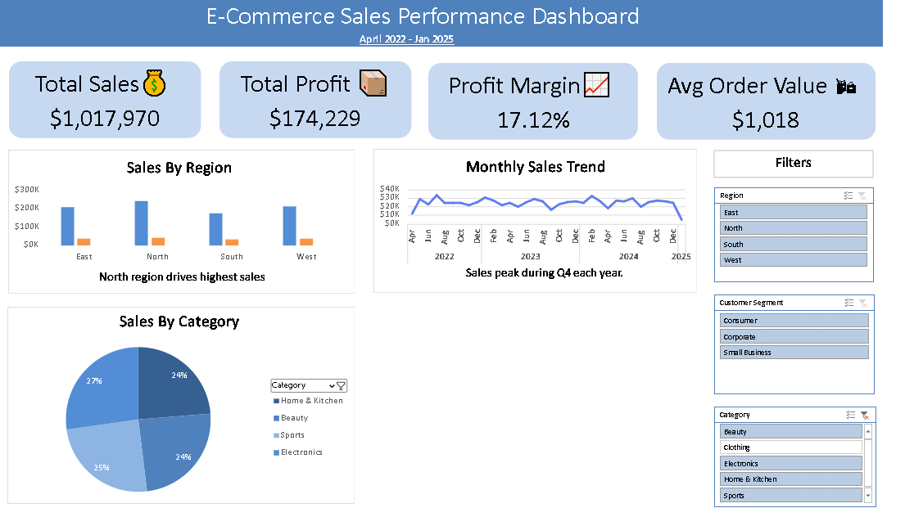

# 📊 E-Commerce Sales Performance Dashboard (Excel)

This project is an interactive Excel dashboard built to analyze sales performance across regions, categories, and customer segments.

---

## 🚀 Key Highlights

- 1,000+ rows realistic E-commerce dataset  
- KPIs: Total Sales, Profit, Profit Margin, Avg Order Value  
- Interactive slicers for Region, Category, and Segment  
- PivotTables + PivotCharts integration  
- Professional layout and color formatting  
- Custom number formatting ($300K style)

---

## 🧠 Business Insights

- **North region** drives the highest sales.  
- **Home & Kitchen** and **Beauty** are top-performing categories.  
- **Q4 each year** shows a consistent sales spike.  
- **Average Order Value:** $1,018  
- **Profit Margin:** 17.12%

---

## 📂 Files in this Repository

| File | Description |
|------|--------------|
| `Ecommerce_Sales_Dashboard.xlsx` | Final Dashboard (interactive) |
| `Ecommerce_Sales_Dataset.xlsx` | Dataset used for analysis |
| `Dashboard_Screenshot.png` | Dashboard preview image |

---

## 🖼️ Dashboard Preview

---

## 🛠️ Tools Used

- Microsoft Excel  
- PivotTables & PivotCharts  
- Slicers & Filters  
- Conditional Formatting  

---

## 👩‍💻 Author

**Rakshita Mahar**  
📧 [Add your email]  
🔗 [Add your LinkedIn link]  

---

⭐ If you like this project, please give it a **star** to support my work!
